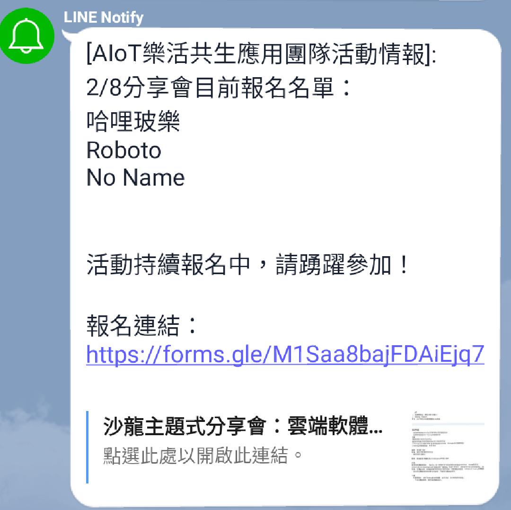

# AIoT Group Notifier

The event notifier for LINE group: *AIoT樂活共生應用團隊*. The notifier sends event information everyday (or periodically). An example event information is shown as follows:



## Prerequisites

- [Node.js](https://nodejs.org/) >= 8.0
- [Yarn](https://yarnpkg.com/)

## Steps

* Clone the project
```bash
git clone https://github.com/SuJiaKuan/aiot-group-notifier
```

* Change into the root directory of the project
```bash
cd aiot-group-notifier
```

* Install the dependencies
```bash
yarn install
```

* Enable the Google Sheets API via [Node.js Quickstart](https://developers.google.com/sheets/api/quickstart/nodejs) and save the credentials as `credentials.json` in the project root directory

* Run Sheets token generation script
```bash
yarn gen-sheets-token
```

* Go to [LINE Notify](https://notify-bot.line.me/my/) page and generate a access token to *AIoT樂活共生應用團隊*.

* Modify [config.js](config.js) as your requirements
  * `spreadsheets.spreadsheetId`: The ID of your Spreadsheet that links to your event Google Form (See [here](https://developers.google.com/sheets/api/guides/concepts#common_terms) to know how to get the ID)
  * `spreadsheets.range`: The cells range in you Spreadsheet that contain the names of event particiners
  * `lineNotify.accessToken`: The access token for *AIoT樂活共生應用團隊*
  * `event.date`: The event date
  * `event.formLink`: The Google form of the event
  * `schedule.endTime`: The end time of the notifier
  * `schedule.cronjob`: Cron Job settings for notifier

* Run the notifier and it will send event information periodically
```bash
yarn start
```
